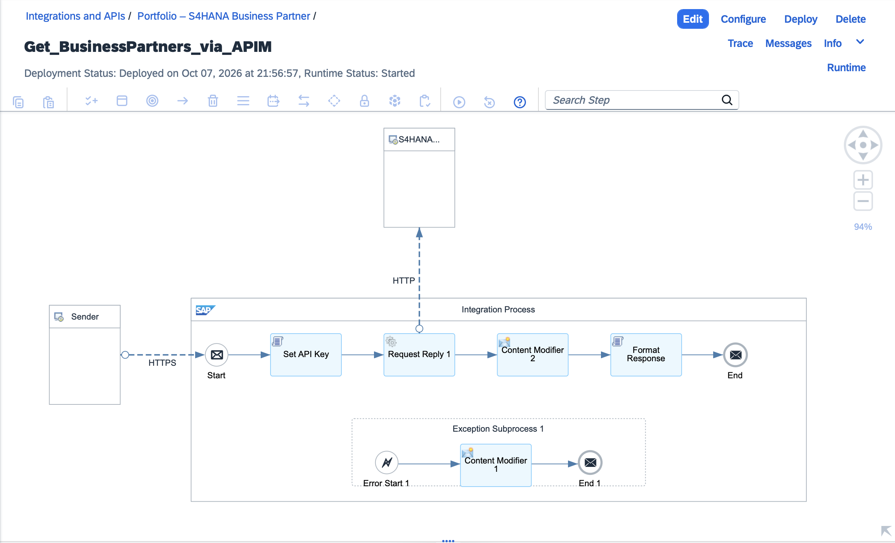
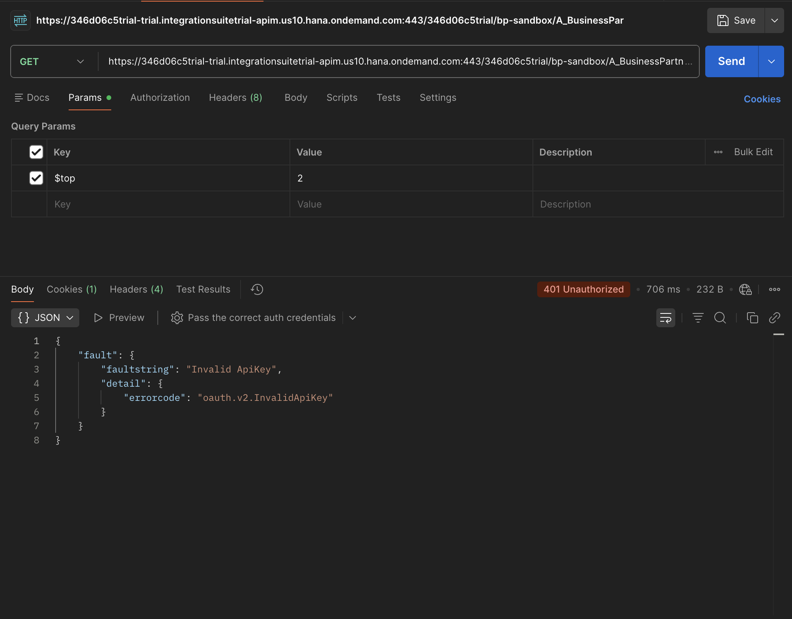
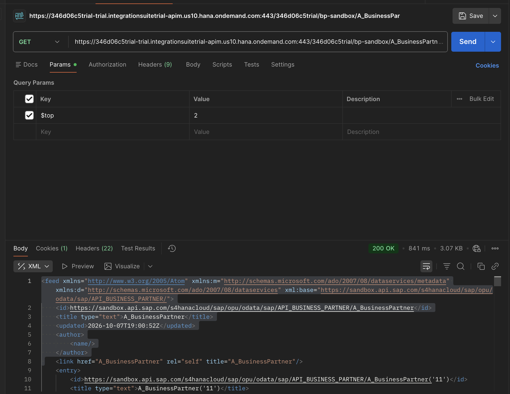
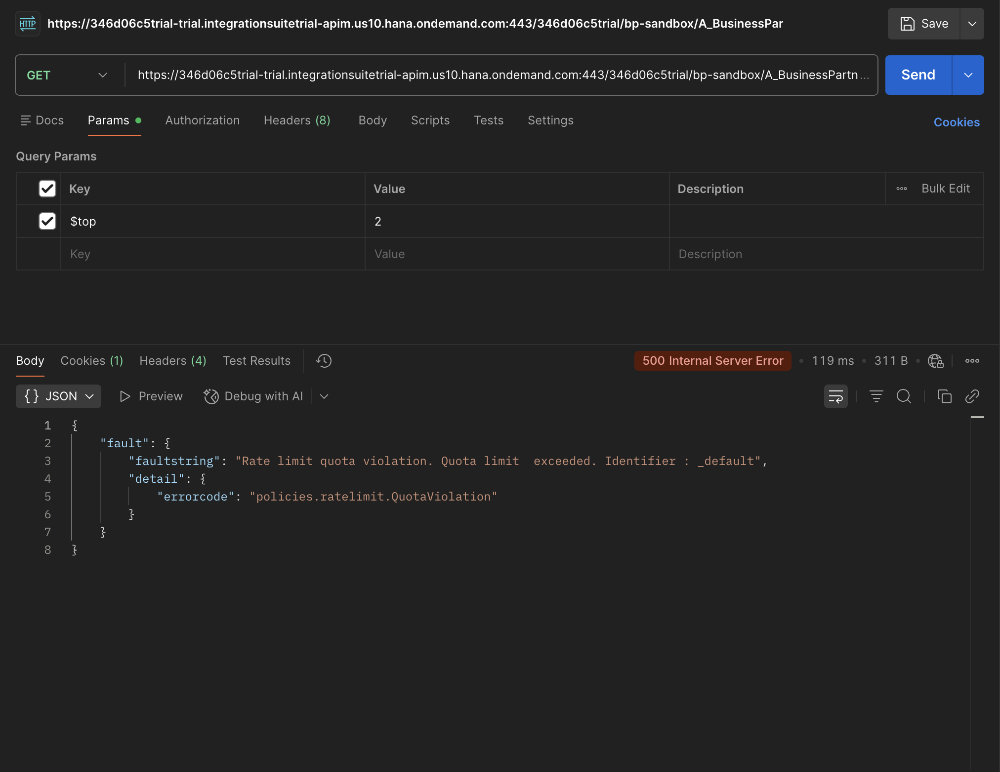
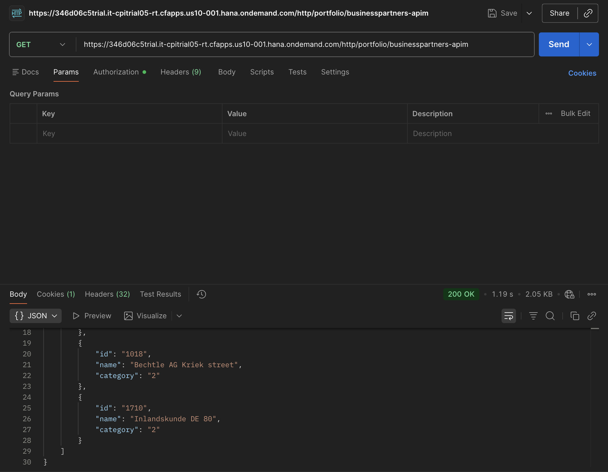

# SAP API Management – Secured Proxy for the S/4HANA Business Partner API

An API proxy on **SAP API Management** (SAP Integration Suite) that sits between a Cloud Integration iFlow and the **SAP S/4HANA Cloud sandbox API**. The proxy holds the backend API key in an encrypted store, verifies each caller, limits the call rate, and adds the backend key itself, so the integration layer never handles the S/4HANA credential.

This is the follow-up to [SAP CPI – S/4HANA Business Partner Integration](https://github.com/UdayPappu/sap-cpi-s4hana-business-partner). That project named one limitation: the iFlow had to read the backend key and place it in a header. This project removes it.

Built on an SAP BTP trial account. The backend is SAP's public sandbox, so all data shown is SAP demo data.

## The problem

In the first project the iFlow called S/4HANA directly:

```
Postman ──▶ iFlow ──▶ S/4HANA sandbox
            (holds the S/4HANA key)
```

That works, but:

- every iFlow that calls S/4HANA needs its own copy of the backend key
- nothing limits how often a caller can call
- callers cannot be told apart or blocked individually

## The solution

```
Postman ──OAuth──▶ iFlow ──application key──▶ API proxy ──S/4HANA key──▶ S/4HANA sandbox
                                              │
                                              ├─ 1. verify the caller's key
                                              ├─ 2. apply the call limit
                                              ├─ 3. read the S/4HANA key (encrypted store)
                                              └─ 4. add it to the request
```

| Concern | Before | After |
|---|---|---|
| Where the S/4HANA key lives | in Cloud Integration, read by a script | only in API Management, encrypted |
| Caller identity | none | one application key per consumer |
| Rate limiting | none | 10 calls per minute at the proxy |
| Revoking one consumer | change the backend key for everyone | remove that consumer's subscription |

## What was built

### 1. API proxy

| Setting | Value |
|---|---|
| Name | `BusinessPartner_Sandbox` |
| Base path | `/bp-sandbox` |
| Target | `https://sandbox.api.sap.com/s4hanacloud/sap/opu/odata/sap/API_BUSINESS_PARTNER` |
| Service type | REST |

### 2. Encrypted Key Value Map

`S4SandboxCredentials`, with one entry `apikey` holding the S/4HANA sandbox key. Once saved, the value cannot be read back in the UI. Only a policy can use it.

### 3. Policies (ProxyEndpoint → PreFlow, incoming request)

The order matters. See *Lessons learned*.

| # | Policy | Type | What it does |
|---|---|---|---|
| 1 | `verifyKey` | Verify API Key | Rejects the call unless the `APIKey` header holds a valid application key. |
| 2 | `limitCalls` | Quota | Allows 10 calls per minute, then rejects. |
| 3 | `getS4Key` | Key Value Map Operations | Reads the S/4HANA key from the encrypted map into a private variable. |
| 4 | `setS4Key` | Assign Message | Replaces the `APIKey` header with the S/4HANA key before the call goes to the backend. |

The caller's key and the backend key use the same header name. The proxy checks the caller's key first and then overwrites it, so the caller's key never reaches S/4HANA and the backend key never reaches the caller.


The policy XML is in the [`policies`](policies) folder.

### 4. Product and application

- **Product** `BusinessPartnerProduct` ("Business Partner API"), containing the proxy, published to Developer Hub.
- **Application** `CPI_BusinessPartner_iFlow`, subscribed to the product in Developer Hub. This is where the iFlow's own application key comes from.

### 5. iFlow `Get_BusinessPartners_via_APIM`

A copy of the first project's iFlow with three changes:

| Part | Before | After |
|---|---|---|
| Sender address | `/portfolio/businesspartners` | `/portfolio/businesspartners-apim` |
| Key read by the script | `S4_SANDBOX_APIKEY` (S/4HANA key) | `APIM_APP_KEY` (application key) |
| Receiver address | the S/4HANA sandbox | the API proxy |

The iFlow still returns the same simplified JSON. It no longer has any access to the S/4HANA key.



## Test results

| Test | Result |
|---|---|
| Proxy, before any policy | 401 from S/4HANA: the proxy forwards, but no backend key is attached |
| Proxy, no application key | 401 `FailedToResolveAPIKey`: the proxy rejects the caller |
| Proxy, valid application key | 200 with business partner data |
| Proxy, 11th call within a minute | rejected with `policies.ratelimit.QuotaViolation` |
| iFlow end to end | 200 with the simplified list of five partners |

**Caller without a key**



**Caller with a valid application key**



**Call limit reached**



**iFlow through the proxy**



## Security design

- **Backend credential in one place.** The S/4HANA key exists only in an encrypted Key Value Map in API Management. It is read into a `private.` variable, which is masked in traces.
- **Per-consumer keys.** Each consumer subscribes to the product and gets its own application key, which can be revoked without touching the backend or other consumers.
- **Layered authentication.** The iFlow endpoint is protected by Cloud Integration (role `ESBMessaging.send`, client credentials). The proxy is protected by the application key. The backend is protected by its own key.
- **No secrets in the repository.** The application key is stored in Cloud Integration as the secure parameter `APIM_APP_KEY`. No key appears in the iFlow, the policies or the screenshots.
- **Rate limiting at the edge.** Excess calls are rejected before the backend key is even read.

## Lessons learned

- **Policy order is part of the design.** `verifyKey` was first added at the end of the flow, after `setS4Key`. Because both use the `APIKey` header, the proxy was verifying the S/4HANA key it had just written and rejected every call with `InvalidApiKey`, even with no key sent. Moving `verifyKey` to the first position fixed it.
- **Activating the capability is not enough.** On the trial tenant, the API Management runtime had to be activated separately under *Settings → Runtimes* before the API menus appeared. Developer Hub also had to be opened once before a product could be published.
- **SAP's policy schema is strict about element order.** A valid Quota policy was rejected until `TimeUnit` was placed last.

## Known limitations

- A quota violation is returned as HTTP 500 with the error code `QuotaViolation`. A fault rule could map it to 429 Too Many Requests.
- The quota is one shared counter. Adding the application key as the quota identifier would give each consumer its own limit.
- The S/4HANA sandbox is a shared demo system with read-mostly behaviour.

## Repository contents

| Path | Content |
|---|---|
| `policies/` | The four proxy policies as XML, numbered in execution order |
| `Get_BusinessPartners_via_APIM.zip` | Exported integration flow |
| `screenshots/` | Policy editor, test results, iFlow diagram |

## Technologies

SAP API Management · SAP Integration Suite (Cloud Integration) · SAP BTP · Developer Hub · SAP S/4HANA Cloud OData V2 API · Groovy · OAuth 2.0 · API key verification · Quota policy · Encrypted Key Value Maps

## Author

Sai Uday Bhaskar Pappu – SAP Integration Developer (SAP Integration Suite / CPI), MSc Cybersecurity
